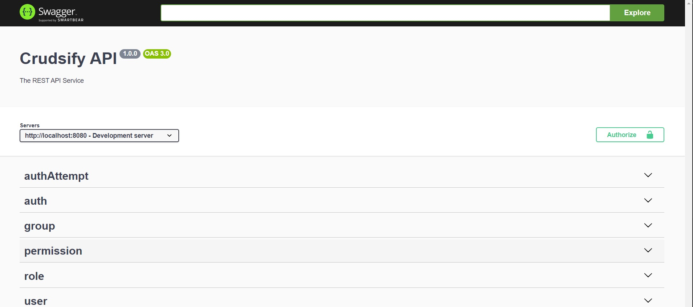

# Swagger documentation

Swagger documentation is automatically generated *(If **enableSwagger** option is enabled in configuration)* for all endpoints and can be viewed by pointing a browser at the **https?://.../docs**. If you use the quick start script this will be *http://localhost:8080/docs*. The swagger docs provide quick access to testing your endpoints along with model schema descriptions and query options.

